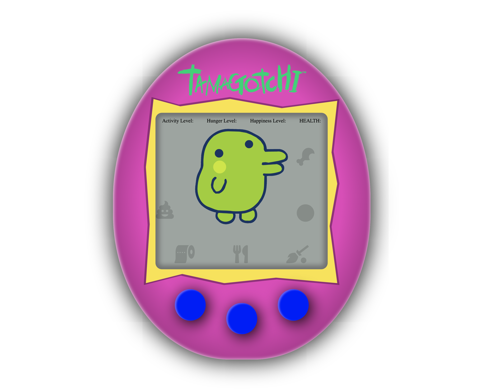

# Tamagotchi

#### _Front End Development/React Week 2 - 4.24.19_

#### By _**Randee Layosa and Maly Phongsavanh**_


[](https://opensource.org/licenses/MIT)

## Description

_This application uses React to create a web replica of the popular 90's Japanese toy, "Tamagotchi"._

## Preview
<p align="center">Original toy | Screenshot</p>
<p align="center">


</p>

## Technologies Used

  * _React_
  * _Webpack_
  * _eslint_
  * _JSX_

## Setup/Installation Requirements

#### To open and view this project file:
1. Go to https://########.firebaseapp.com to view the live deployed app.
2. Or, clone this GitHub repository https://github.com/randeelayosa/tamagotchi.git to your Desktop.
  * Install git onto your computer if it isn't already.
  * To clone the project down to your desktop, open your Terminal, and enter the following commands:
  ```
  cd desktop
  git clone [paste link here]
  cd [project folder name]
  atom .
  npm install
  npm run start
  ```
  * _You can use another text editor if Atom is not your preferred program._
  * _Make sure a "node_modules" and "dist" folder are created in your project file. If it hasn't, run `npm install` again._
  * _You can then go to the link in step 1 above, or continue on to the following instructions to run the server._
3. Go to http://localhost:8080/ in the browser of your choice. _Note: The app will automatically reload if you edit any of the code in the source files._


## Planning

  | **Configuration/Dependencies** | **Use** |
| :-------------     | :------------- |
| Babel | JS transpiler |
| CSS-Loader, Style-Loader, Sass-Loader, Node-Sass | styling |
| ESLint | JS linter, checks code for errors |
| File-Loader, URL-Loader | image loader |
| HTML-Webpack-Plugin | loads HTML file |
| Jasmine, Karma | for testing code |
| React | JS Library |
| Webpack | bundles/compiles code |

**Component Layout**

<p align="center">
  
</p>

**Features Built and To Be Completed**
- [ ] Feeding function
- [ ] Playing function
- [ ] Resting function
- [x] Set time interval
- [ ] Health inventory
- [ ] Button functionality
- [x] Tamagotchi Egg styling
- [ ] Add animations to player icon
- [ ] Program has a Firebase database established
- [ ] Program is deployed

**Integration**
  * src folder: files responsible for UI code and backend functionality
  * Integrate Firebase to add keep track of Add and Edit functionality

**UX/UI**
  * Program button functionality.
  * Add animations.

**Polish**
  * Delete unused dependencies in `package.json` and plugins in the config files
  * Ensure README includes all necessary language for instructions, bugs, and documentation

### Legal

*This software is licensed under MIT license.*

Copyright (c) 2019 **_Randee Layosa and Maly Phongsavanh_**
